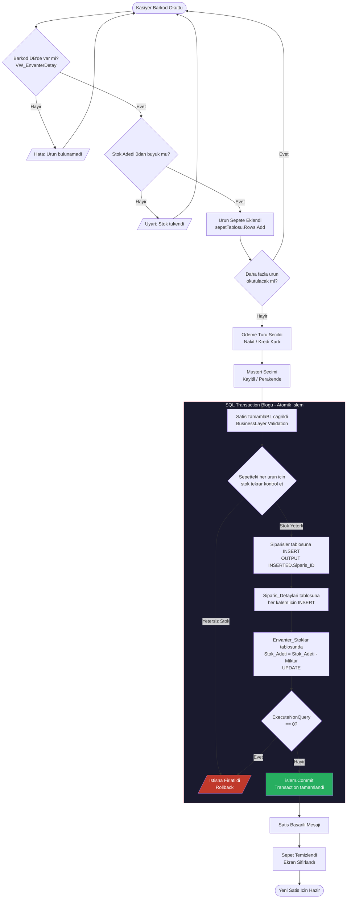
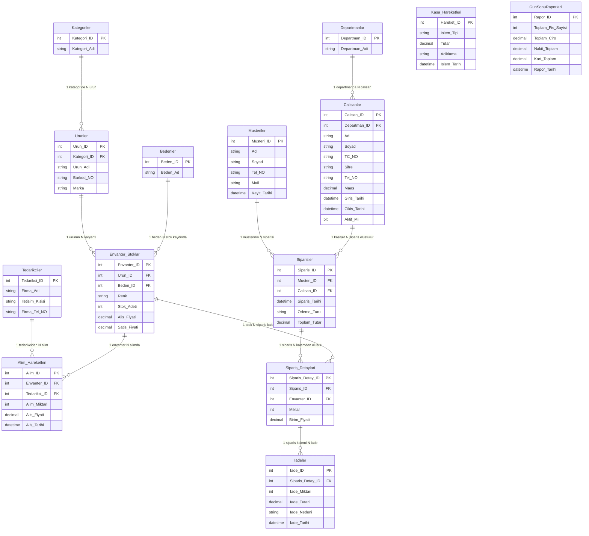

# LoomOS — Konfeksiyon ve Giyim Mağazaları İçin ERP Otomasyon Sistemi

> **Geliştirme Ortamı:** C# · .NET 10 · Windows Forms · Microsoft SQL Server  
> **Mimari:** N-Tier (Çok Katmanlı) · ADO.NET · Parametreli Sorgular  
> **Versiyon:** 1.0.0 · © 2026 LoomOS Project

---

## İçindekiler

1. [Problem Tanımı](#1-problem-tanımı)
2. [Yapılan Araştırmalar](#2-yapılan-araştırmalar)
3. [Akış Şeması](#3-akış-şeması)
4. [Yazılım Mimarisi](#4-yazılım-mimarisi)
5. [Veritabanı Diyagramı](#5-veritabanı-diyagramı)
6. [Genel Yapı](#6-genel-yapı)
7. [Referanslar](#7-referanslar)

---

## 1. Problem Tanımı

### 1.1 Giyim Sektöründeki Operasyonel Kaos

Küçük ve orta ölçekli giyim mağazaları, günümüzde birbirinden bağımsız ve dağınık yönetim süreçleriyle faaliyet göstermektedir. Bu durum, başta aşağıdaki alanlarda kritik operasyonel sorunlara neden olmaktadır:

**Stok ve Envanter Yönetimi Karmaşası**

Konfeksiyon sektörü, diğer perakende alanlarından farklı olarak ürünleri salt "adet" bazında değil; **renk × beden kombinasyonu** şeklinde çok boyutlu bir envanter mantığıyla yönetmek zorundadır. Geleneksel yöntemlerle (kâğıt, Excel, birbiriyle konuşmayan yazılımlar) yürütülen bu süreç; yanlış stok tespitine, kayıp satışlara ve depolarda çürüyen stoklara yol açmaktadır. Bir müşteri "Kırmızı — L beden" bir ürün sorduğunda, kasiyerin arka depoyu aramak yerine sisteme bakıp anlık yanıt verebilmesi, modern perakendenin temel gereksinimidir.

**Kasa ve Finans Yönetiminde Şeffafsızlık**

Manuel kasa tutulması; hata payını artırmakta, gelir/gider takibini zorlaştırmakta ve gün sonu Z-raporu gibi zorunlu muhasebe işlemlerini hantal bir süreç haline getirmektedir. Nakit ve kredi kartı cirolarının ayrı ayrı ve anlık izlenememesi, işletme sahiplerinin doğru karar almasını engellemektedir.

**Müşteri İlişkileri ve Sadakat Yönetimi**

Müşteri verilerinin kâğıt fişlerde veya dağınık dosyalarda tutulması; müşteri geçmişine erişimi, iade takibini ve kişiselleştirilmiş hizmeti imkânsız kılmaktadır.

**Personel ve İnsan Kaynakları**

Maaş işlemleri, işe giriş-çıkış tarihleri ve departman bazlı yetki yönetimi, birbirinden bağımsız araçlarla tutulduğunda hem hata oranı yükselmekte hem de işletme güvenlik riskleriyle karşı karşıya kalmaktadır.

### 1.2 LoomOS'un Çözüm Yaklaşımı

**LoomOS**, yukarıda sıralanan tüm bu sorunlara tek bir merkezi platform üzerinden yanıt veren, C# WinForms tabanlı bir masaüstü ERP (Enterprise Resource Planning) uygulamasıdır.

Sistemin temel çözüm mantığı şöyle özetlenebilir:

| Sorun Alanı | LoomOS Çözümü |
|---|---|
| Çok boyutlu stok (renk/beden) | `Envanter_Stoklar` tablosunda `Beden_ID` + `Renk` kombinasyonu; her varyant ayrı kayıt |
| Kasa şeffaflığı | `Kasa_Hareketleri` tablosu + SQL Stored Procedure ile otomatik Z-raporu |
| Satış esnasında stok düşümü | `SiparisDAL.SatisiTamamla()` metodunda atomik SQL Transaction ile eş zamanlı stok güncelleme |
| Müşteri yönetimi | `Musteriler` tablosu ve ad/soyad/telefon bazında anlık filtreleme (LIKE sorgusu) |
| Personel ve yetki | `Departman_ID` bazlı rol sistemi; her sekme, oturum açan kullanıcının departmanına göre dinamik olarak gösterilip/gizleniyor |
| İade süreci | Atomik transaction ile stok iadesi + sipariş tutarı güncellemesi eş zamanlı gerçekleşiyor |

Sistem, **tek bir çalışan** bile olsa tüm mağaza süreçlerini yönetebilecek şekilde tasarlanmış; aynı zamanda departman bazlı yetki sistemiyle büyük ekiplere de ölçeklenebilir bir yapı sunmaktadır.

---

## 2. Yapılan Araştırmalar

### 2.1 UI/UX: Windows Forms Modernizasyonu

.NET ekosisteminde masaüstü uygulama geliştirme için WPF, WinForms ve MAUI gibi seçenekler mevcuttur. LoomOS'ta **Windows Forms** tercih edilmiş; bunun başlıca nedenleri şunlardır:

- **Hızlı Prototipleme:** Form tasarımcısı (Designer), sekme tabanlı (TabControl) karmaşık arayüzleri görsel olarak oluşturmaya imkân tanımaktadır.
- **DataGridView Entegrasyonu:** SQL'den gelen `DataTable` nesneleri, herhangi bir dönüşüm katmanına ihtiyaç duyulmaksızın doğrudan `DataGridView.DataSource` özelliğine bağlanabilmektedir.
- **Düşük Öğrenme Eğrisi:** Ekip açısından yetkinlik gerektiren XAML/MVVM yerine, event-driven (olay güdümlü) programlama paradigması tercih edilmiştir.

Modernizasyon kapsamında yapılan araştırmalar sonucunda şu kararlar alınmıştır:

- **Sekme tabanlı navigasyon (TabControl):** Tek form üzerinde birden fazla modülü yönetmek için kullanılmıştır. Bu yaklaşım, MDI (Multiple Document Interface) alternatifine kıyasla daha öngörülebilir bir layout yönetimi sağlamaktadır.
- **Dinamik yetki bazlı sekme gösterimi:** `TabPages.Remove()` / `TabPages.Add()` yöntemleriyle kullanıcının departmanına göre sekmeler çalışma zamanında (runtime) gizlenip açılmaktadır. Bu, "gizli ama erişilebilir" güvenlik açığını önlemeye yönelik proaktif bir tasarım kararıdır.
- **BindingSource kullanımı:** ComboBox gibi kontrollerde veri bağlamayı kararlı hale getirmek için doğrudan `DataTable` yerine `BindingSource` nesnesi aracı olarak kullanılmıştır.

### 2.2 ADO.NET ile Güvenli Veritabanı Bağlantısı

Veritabanı erişim stratejisi belirlenirken ORM (Entity Framework gibi) ile doğrudan ADO.NET arasında karşılaştırmalı bir değerlendirme yapılmıştır. Konfeksiyon ERP senaryosunda **ADO.NET** tercih edilmesinin teknik gerekçeleri:

- **Granüler Kontrol:** Satış işlemi gibi kritik operasyonlarda `SqlTransaction` nesnesi ile atomik işlem bloğu tanımlanabilmektedir. Bu, ORM'lerin sağladığı üst düzey soyutlamanın bazen engel oluşturduğu senaryolarda açık bir avantajdır.
- **SQL Injection Koruması:** Tüm sorgularda `SqlParameter` kullanımı zorunlu kılınmıştır. `SQLBaglantisi` sınıfı; `EkleSilGuncelle()`, `SorguCalistirTablo()` ve `TekDegerGetir()` gibi yardımcı metodlar aracılığıyla parametreli sorgu kullanımını standart bir merkezi yöntemle garanti altına almaktadır.
- **Bağlantı Yönetimi:** `using (SqlConnection ...)` bloğu ile bağlantılar, işlem tamamlandıktan sonra dispose edilmektedir. Bu, veritabanı bağlantı havuzu (connection pool) yönetimini optimize etmektedir.
- **CommandBehavior.CloseConnection:** `SqlDataReader` kullanılan sorgularda, okuyucu kapatıldığında bağlantının da otomatik kapanması sağlanmış; bu sayede bağlantı sızıntısı (connection leak) riski minimize edilmiştir.

```csharp
// SQLBaglantisi.cs — Merkezi ve güvenli sorgu çalıştırma metodunun özeti
public static DataTable SorguCalistirTablo(string sorgu, SqlParameter[] parametreler)
{
    DataTable tablo = new DataTable();
    using (SqlConnection baglan = BaglantiOlustur())
    {
        baglan.Open();
        using (SqlCommand komut = new SqlCommand(sorgu, baglan))
        {
            if (parametreler != null) komut.Parameters.AddRange(parametreler);
            using (SqlDataAdapter adaptor = new SqlDataAdapter(komut))
                adaptor.Fill(tablo);
        }
    }
    return tablo;
}
```

### 2.3 SQL Server View ve Stored Procedure ile Otomatik Kasa Yönetimi

Veritabanı nesnelerinin uygulama katmanında nasıl kullanılacağı üzerine yapılan araştırmalar sonucunda iki kritik SQL nesnesi sisteme entegre edilmiştir:

**SQL View'ları (Sanal Tablolar)**

`VW_EnvanterDetay` adlı view, `Envanter_Stoklar`, `Urunler`, `Bedenler` ve `Kategoriler` tablolarını birleştirerek kasiyerin barkod okuttuğunda ihtiyaç duyduğu tüm bilgileri (ürün adı, beden, renk, stok adedi, satış fiyatı) tek bir `SELECT * FROM VW_EnvanterDetay` sorgusuyla sunmaktadır. Bu yaklaşım:

- Uygulama kodundan JOIN mantığını soyutlamaktadır.
- Performans optimizasyonuna (index'leme) veritabanı katmanında izin vermektedir.
- Kasiyerin barkod bazlı arama yapabilmesini (`WHERE Barkod_NO = @p1`) olanaklı kılmaktadır.

`vw_GecmisZRaporlari` ve `Vw_Calisan_Detay` view'ları da benzer şekilde, uygulama kodunu karmaşık JOIN sorgularından arındırmaktadır.

**Stored Procedure**

`sp_BugununOzetiniGetir` adlı saklı yordam, günlük fiş sayısı, toplam ciro, nakit ve kart toplamlarını hesaplayarak Z-raporu ekranına tek sorguda sunmaktadır. `RaporDAL.BugununOzetiniGetir()` metodu, bu prosedürü `CommandType.StoredProcedure` parametresiyle çağırmaktadır. Bu mimari karar, raporlama mantığını veritabanı katmanında merkezileştirmekte ve uygulama kodunun bakımını kolaylaştırmaktadır.

---

## 3. Akış Şeması

Aşağıdaki diyagram, LoomOS'ta **barkod tabanlı satış işleminin** tamamlanmasından stok düşümüne ve kasa hareketine yansımasına kadar olan uçtan uca süreci göstermektedir.



---

## 4. Yazılım Mimarisi

### 4.1 Genel Mimari: N-Tier (Çok Katmanlı) Yaklaşım

LoomOS, klasik **3 Katmanlı (Three-Tier) Mimari**yi benimseyen ve her katmanın ayrı bir C# sınıf kütüphanesi (Class Library) olarak projelendirildiği bir yapı sunmaktadır.

```
+--------------------------------------------------------------------+
|  SUNUM KATMANI  (LoomOS_UI - Windows Forms)                        |
|  Form1.cs / frmLogin.cs                                            |
|  * Kullanici Arayuzu: TabControl, DataGridView, ComboBox           |
|  * Sadece BusinessLayer'a bagimlidir; DAL'a dogrudan erisemez     |
+---------------------------+----------------------------------------+
                            |  Metod cagrisi (statik)
+---------------------------v----------------------------------------+
|  IS KURALLARI KATMANI  (BusinessLayer - Class Library)             |
|  CalisanManager / SiparisManager / EnvanterManager / vb.          |
|  * Dogrulama (Validation): Bos alan, negatif deger, yetki kontrolu|
|  * Kural Motoru: Zararına satis yasagi, TC uzunluk kontrolu       |
|  * EntityLayer ve DataAccessLayer'a bagimlidir                     |
+---------------------------+----------------------------------------+
                            |  Metod cagrisi (statik)
+---------------------------v----------------------------------------+
|  VERI ERISIM KATMANI  (DataAccessLayer - Class Library)            |
|  SiparisDAL / EnvanterDAL / CalisanDAL / SQLBaglantisi / vb.      |
|  * ADO.NET: SqlConnection, SqlCommand, SqlDataReader, SqlTransaction|
|  * View, Stored Procedure ve parametreli SQL sorgulari             |
|  * Yalnizca EntityLayer'a bagimlidir                               |
+---------------------------+----------------------------------------+
                            |  SQL sorgulari
+---------------------------v----------------------------------------+
|  VERITABANI  (Microsoft SQL Server - LoomOS DB)                    |
|  Tablolar / View'lar / Stored Procedure'lar                        |
+--------------------------------------------------------------------+

          +----------------------------------+
          |  VARLIK KATMANI  (EntityLayer)   |
          |  POCO Siniflar: Calisan, Siparis |
          |  KullaniciSession (static)       |
          |  Tum katmanlar tarafindan ortak  |
          |  kullanilir                      |
          +----------------------------------+
```

### 4.2 Katman Detayları

#### EntityLayer (Varlık Katmanı)

Veritabanındaki tablolarla birebir eşleşen **POCO (Plain Old CLR Object)** sınıflarını barındırır. Herhangi bir iş mantığı veya veritabanı erişim kodu içermez; yalnızca veri taşıma amacıyla kullanılır.

| Sınıf | Karşılık Geldiği Tablo |
|---|---|
| `Calisan` | `Calisanlar` |
| `Siparis` | `Siparisler` |
| `SiparisDetay` | `Siparis_Detaylari` |
| `EnvanterStok` | `Envanter_Stoklar` |
| `Musteri` | `Musteriler` |
| `Urun` | `Urunler` |
| `Tedarikci` | `Tedarikciler` |
| `KullaniciSession` | *(statik, oturum yönetimi)* |

`KullaniciSession`, oturum açan kullanıcının `Calisan_ID`, `Departman_ID` ve `AdSoyad` bilgilerini uygulama yaşam döngüsü boyunca bellekte tutan **statik sınıftır**. Bu, servis bağımsız bir oturum yönetimi mekanizması işlevi görür.

#### DataAccessLayer (Veri Erişim Katmanı)

`SQLBaglantisi` sınıfı, tüm DAL sınıfları için **merkezi bağlantı ve sorgu yürütme altyapısını** oluşturur. Bu sınıftaki yardımcı metodlar, veritabanı erişim kodunun tekrarlanmasını (code duplication) önleme amacıyla tasarlanmıştır:

```csharp
// Tek skaler değer için
public static string TekDegerGetir(string sorgu)

// DataTable döndüren sorgular için
public static DataTable SorguCalistirTablo(string sorgu, SqlParameter[] parametreler)

// INSERT/UPDATE/DELETE için
public static int EkleSilGuncelle(string sorgu, SqlParameter[] parametreler)

// Akış kontrolü gerektiren sorgular için
public static SqlDataReader SorguCalistir(string sorgu, SqlParameter[] parametreler)
```

#### BusinessLayer (İş Kuralları Katmanı)

Her Manager sınıfı, aynı ada sahip DAL sınıfına karşılık gelir ve yalnızca **iş kuralı doğrulaması** yapar. Doğrulama geçilirse DAL metodunu çağırır; geçilmezse anlamlı bir `Exception` fırlatır.

**Örnek İş Kuralları:**
- `EnvanterManager.StokVaryantEkleBL()`: Satış fiyatı, alış fiyatından büyük olmalıdır (zararına satış yasağı).
- `CalisanManager.MaasGuncelleBL()`: Yalnızca `Departman_ID == 1` (Yönetim) yetkisine sahip kullanıcılar maaş güncelleyebilir.
- `MusteriManager.MusteriEkleBL()`: E-posta adresi girilmişse `@` karakteri içermelidir.
- `SiparisManager.SatisiTamamlaBL()`: Sepet boş olamaz; ödeme türü zorunludur; oturum geçerli olmalıdır.

#### Sunum Katmanı (LoomOS_UI)

`Form1.cs`, N-Tier mimarisinin kuralına uygun olarak **yalnızca BusinessLayer'a bağımlıdır**; DAL'a doğrudan erişim yoktur. Form yüklendiğinde (`Form1_Load`) departman bazlı sekme görünürlüğü ayarlanır; bu yaklaşım, farklı roller için farklı arayüz deneyimi sağlar:

| Departman ID | Rol | Erişilebilir Sekmeler |
|---|---|---|
| 1 | Yönetim | Tümü |
| 2 | Kasa / Satış | Dashboard, Kasa, Sipariş Geçmişi, İade, Müşteriler |
| 3 | Depo / Lojistik | Dashboard, Ürünler, Sipariş Geçmişi, Satın Alımlar |
| 4 | Muhasebe | Dashboard, Ürünler, Çalışanlar, İadeler, Finans, Satın Alımlar |
| 5 | İnsan Kaynakları | Dashboard, Çalışanlar, Müşteriler |

### 4.3 OOP Prensiplerinin Uygulanması

- **Kapsülleme (Encapsulation):** Entity sınıflarındaki tüm alanlar `{ get; set; }` property olarak tanımlanmıştır; doğrudan alan erişimi (public field) yoktur.
- **Soyutlama (Abstraction):** `SQLBaglantisi` sınıfı, bağlantı yönetiminin karmaşıklığını diğer katmanlardan gizlemektedir. Bir DAL sınıfı, nasıl bağlantı kurulduğunu bilmez; yalnızca `SQLBaglantisi.SorguCalistirTablo()` metodunu çağırır.
- **Tek Sorumluluk Prensibi (SRP):** Her DAL ve Manager sınıfı yalnızca kendi varlığıyla ilgili işlemleri yürütür. `SiparisDAL`, yalnızca sipariş işlemleri için SQL sorguları çalıştırır.
- **Atomiklik (Transactions):** Birden fazla tablonun etkilendiği kritik işlemlerde (`SatisiTamamla`, `IadeIsleminiYap`, `SatinAlimYap`) `SqlTransaction` kullanılmıştır. Herhangi bir adımda hata oluşursa `Rollback()` ile tüm değişiklikler geri alınır.

---

## 5. Veritabanı Diyagramı

Aşağıdaki ER diyagramı, LoomOS veritabanındaki temel tablolar ile aralarındaki birincil anahtar (PK) ve yabancı anahtar (FK) ilişkilerini göstermektedir.



### 5.1 Kritik İlişki Açıklamaları

- **Çok Boyutlu Envanter Yapısı:** `Envanter_Stoklar`, `Urunler` ve `Bedenler` tablolarını birleştiren bir **kesişim tablosu (junction table)** işlevi görür. Bu sayede aynı ürünün farklı renk ve beden kombinasyonları ayrı envanter kayıtları olarak tutulur.
- **Opsiyonel Müşteri İlişkisi:** `Siparisler.Musteri_ID` alanı `NULL` olabilir. Bu, kayıtlı müşterisi olmayan "perakende satış" senaryosunu destekler.
- **İade Zincirleme Güncelleme:** İade işlemi gerçekleştiğinde `IadeDAL.IadeIsleminiYap()`, tek bir transaction içinde `Iadeler` kaydı oluşturur, `Envanter_Stoklar.Stok_Adeti`ni artırır ve `Siparisler.Toplam_Tutar`ı düşürür.

---

## 6. Genel Yapı

LoomOS, birbirine entegre **6 ana fonksiyonel modülden** oluşmaktadır:

---

### Modül 1: Dashboard (Yönetim Paneli)
**Sekme:** `tabPageDashboard`

**Yetenekler:**
- Anlık toplam müşteri ve çalışan sayısı
- Günlük ciro özeti: Toplam, Nakit ve Kredi Kartı bazında kırılım
- Kritik stok uyarı tablosu: `Stok_Adeti <= 5` olan ürün varyantlarını listeler
- Oturum açan kullanıcıya özel karşılama mesajı

---

### Modül 2: Envanter Yönetimi
**Sekmeler:** `tabPageUrunler`, `tabPageSatinAlimlar`

Konfeksiyon ERP'nin kalbi olan bu modül, iki kademeli bir hiyerarşi sunar:
1. **Ürün Kataloğu:** Ürün adı, kategori, marka ve barkod numarasından oluşan master kayıt.
2. **Stok Varyantı:** Kataloğa bağlı her (Renk + Beden) kombinasyonu için alış/satış fiyatı ve stok adedi.

**Yetenekler:**
- Barkod veya ürün adıyla anlık arama (her tuşa basışta filtreleme)
- Stok varyantı ekleme, güncelleme ve silme
- Satın alım modülü: Tedarikçi seçimi, ürün seçimi, miktar ve alış fiyatı girişi; transaction ile stok otomatik artışı
- `VW_EnvanterDetay` view'ı üzerinden çok tablolu veri tek sorguda görüntüleme

---

### Modül 3: Kasa ve Satış
**Sekmeler:** `tabPageKasa`, `tabPageSiparisGecmisi`

**Yetenekler:**
- Barkod okuyucu entegrasyonu (Enter tuşu veya buton ile)
- Anlık sanal sepet: Aynı ürün tekrar okunduğunda miktar otomatik artışı, stok aşımı kontrolü
- Kayıtlı müşteri veya perakende satış seçimi
- Nakit / Kredi Kartı ödeme türü seçimi
- Tek tıkla siparişi tamamlama: Atomik transaction (stok düşümü + sipariş kaydı eş zamanlı)
- Sipariş geçmişi: Tüm fişler fiş no, kasiyer adı, müşteri, tarih ve tutar ile listelenir

---

### Modül 4: Finans ve Kasa Hareketleri
**Sekmeler:** `tabPageFinans`, `tabPageZRaporu`

**Yetenekler:**
- Ek gelir / gider kaydı (parametreli SQL ile güvenli kayıt)
- Kasa hareket listesi: Tarih, tür, tutar ve açıklama görünümü
- Net kasa bakiyesi: Gelirler toplamı − Giderler toplamı; pozitif/negatif duruma göre yeşil/kırmızı renk
- **Z-Raporu:** Günlük fiş sayısı, toplam ciro, nakit/kart kırılımı; `sp_BugununOzetiniGetir` Stored Procedure ile; `GunSonuRaporlari` tablosuna arşivleme
- Geçmiş Z-raporları listesi

---

### Modül 5: İnsan Kaynakları ve Personel Yönetimi
**Sekmeler:** `tabPageCalisanlar`, `tabPageDepartmanlar`

**Yetenekler:**
- Departman ekleme, güncelleme, silme (CRUD)
- Personel kayıt sistemi: TC Kimlik No, ad-soyad, departman, telefon; sistem tarafından otomatik 6 karakterli şifre üretimi
- Maaş güncelleme (yalnızca `Departman_ID == 1` yetkisiyle)
- İşten çıkarma: `Aktif_Mi = 0` ve şifre `KOVULDU` olarak güncelleme; çıkış tarihi sistem tarafından otomatik kaydedilir
- Şifre değiştirme (profil sekmesi üzerinden)
- `Vw_Calisan_Detay` view'ı ile departman adını da içeren zengin liste görünümü

---

### Modül 6: Müşteri İlişkileri ve İade
**Sekmeler:** `tabPageMusteriler`, `tabPageIadeIslemleri`

**Yetenekler:**
- Müşteri kayıt formu: Ad, soyad, telefon, e-posta (@ format kontrolü ile)
- Ad/Soyad veya telefon bazında LIKE araması (her tuşa basışta dinamik filtreleme)
- İade işlemi: Fiş numarası ile sipariş sorgusu; iade nedeni seçimi; atomik transaction ile stok iadesi + sipariş tutarı güncelleme
- Kayıtlı müşteri olmayan "Perakende Müşteri" senaryosu desteği

---

## 7. Referanslar

1. **Microsoft Corporation.** (2024). *Microsoft.Data.SqlClient Namespace — ADO.NET Documentation*. Microsoft Learn.  
   Erişim: https://learn.microsoft.com/en-us/dotnet/api/microsoft.data.sqlclient  
   > LoomOS'ta kullanılan `SqlConnection`, `SqlCommand`, `SqlDataAdapter`, `SqlTransaction` ve `SqlParameter` sınıflarının resmi teknik dokümantasyonu.

2. **Microsoft Corporation.** (2024). *System.Windows.Forms Namespace — .NET API Reference*. Microsoft Learn.  
   Erişim: https://learn.microsoft.com/en-us/dotnet/api/system.windows.forms  
   > WinForms bileşenlerinin (`TabControl`, `DataGridView`, `BindingSource`, `ComboBox`) resmi API dokümantasyonu; LoomOS arayüz geliştirme sürecinde başvurulan temel kaynak.

3. **Microsoft Corporation.** (2024). *SQL Server Views — Transact-SQL Reference*. Microsoft Learn.  
   Erişim: https://learn.microsoft.com/en-us/sql/relational-databases/views/views  
   > `VW_EnvanterDetay`, `Vw_Calisan_Detay` ve `vw_GecmisZRaporlari` view nesnelerinin tasarımında başvurulan SQL Server View mimarisi ve performans optimizasyonu dokümantasyonu.

4. **Microsoft Corporation.** (2024). *SQL Server Stored Procedures — Transact-SQL Reference*. Microsoft Learn.  
   Erişim: https://learn.microsoft.com/en-us/sql/relational-databases/stored-procedures/stored-procedures-database-engine  
   > Z-raporu üretiminde kullanılan `sp_BugununOzetiniGetir` saklı yordamının ve `CommandType.StoredProcedure` ile C# entegrasyonunun teknik dayanağı.

---

*Bu rapor, LoomOS v1.0.0 kaynak kodu analiz edilerek hazırlanmıştır. © 2026*
